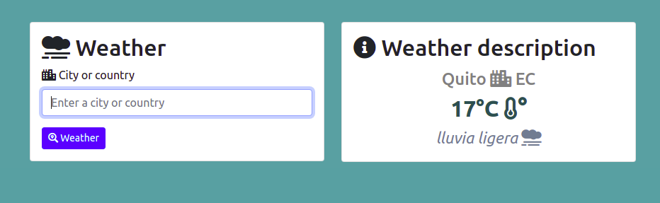

# Python Weather 
Programa para mostrar el tiempo y su descripción respectivo esto esta hecho en python.

# Instalación:
- Tener instalado python 3.x o superior.
- Tener pip instalado.
- Tener virtualenv o venv instalado.
- Crear un entorno virtual con virtualenv o venv.
- Ejecutar requirements.txt dentro del entorno virtual:  
   > pip install -r requirements.txt

## Iniciar el sistema:
- Ejecutar el entorno virtualenv o venv
  > windows: env\Script\activate

  > linux: source env/bin/activate

- Dentro del entorno virtual ejecutar el archivo (.py) principal.
   > windows: python app.py

   > linux: python3 app.py

# Vista del sistema:

## _Realizado por:_

# Github: @harlericho

> The MIT License (MIT)

### Este programa o sistema puede ser tomado como guia o enseñanza para sus futuros  proyectos.
> Copyright (c) 2021 harlericho
